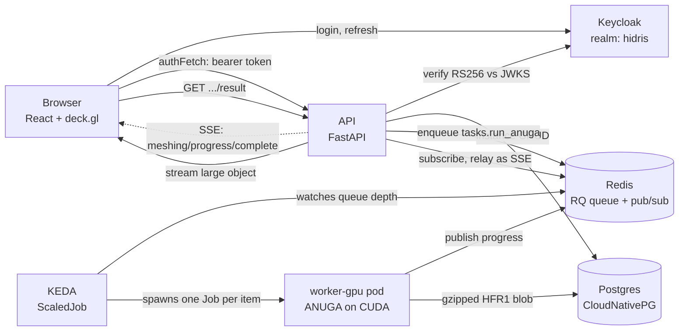
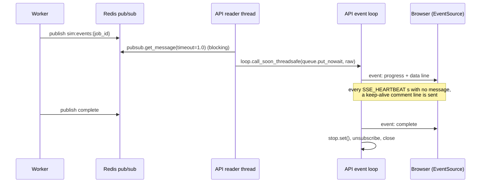
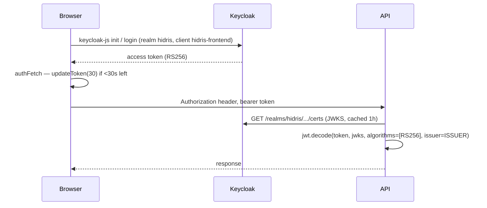

# Architecture

Hidris is a digital twin of a river basin. A user draws boundary conditions and
operators on a map, submits an [ANUGA](https://github.com/anuga-community/anuga_core)
hydrodynamic simulation, watches it run over a live stream, and plays the
resulting flood back over time — in 2D on a basemap or in 3D over terrain.

This document traces the whole path, with real file and line references. Read
it first; the [frontend](frontend-react.md) and [binary format](solution-binary-format.md)
docs zoom into pieces of it.

---

## 1. The shape of the thing



Six moving parts worth holding in your head:

- **The browser owns the setup.** Polygons, boundary conditions, solver config
  — all of it is client state, serialized to JSON and PATCHed to the API on a
  debounce.
- **The API owns nothing but storage and dispatch.** It validates tokens (never
  issues them), does CRUD on Postgres, pushes a job onto Redis, and relays
  progress. It never runs a simulation.
- **The queue is the boundary.** Everything expensive happens on the far side of
  Redis, in a pod that did not exist a moment earlier.
- **Workers are run-once.** KEDA spawns a Kubernetes Job per queued item; the
  worker takes one job, solves it, writes the result, and exits. There is no
  idle GPU.
- **The result never travels as JSON.** It's a binary container written straight
  into a Postgres large object and streamed back gzipped.
- **Progress is pushed, not polled.** Redis pub/sub → SSE → `EventSource`.

---

## 2. Repository layout

This is a **superproject with git submodules**:

| Path | Repo | Notes |
|---|---|---|
| `services/api` | `hidris_api.git` | submodule — its own `.git` |
| `services/frontend` | `FloodViewer.git` | submodule — its own `.git` |
| `services/worker-cpu` | *(this repo)* | plain directory |
| `services/worker-gpu` | *(this repo)* | plain directory |
| `services/jupyter` | *(this repo)* | plain directory |
| `k8s/*.yaml` | *(this repo)* | one manifest per service |
| `Tiltfile` | *(this repo)* | orchestrates the dev stack |

When you edit a file under `services/api` or `services/frontend`, the commit
lands in that submodule's repo, not here. `git remote -v` inside the directory
tells you where you are.

---

## 3. The job lifecycle, traced

### 3.1 Submit

The user clicks Run. `SimulationProvider.submitSimulation`
(`services/frontend/src/context/SimulationProvider.tsx:512`) does three things
in order:

1. Cancels the pending debounced autosave and PATCHes the current setup
   immediately — otherwise the worker could solve a stale version of the setup.
2. `enqueueSimulation(publicId)` → `POST /api/instances/{id}/simulate`.
3. Opens the SSE stream with the returned `job_id`.

The API handler (`services/api/src/main.py:220`) loads the instance, checks it
belongs to this user, and enqueues:

```python
job = q.enqueue(
    "tasks.run_anuga",
    {"public_id": str(public_id), "payload": inst["instance"]},
    job_timeout=JOB_TIMEOUT,
    result_ttl=RESULT_TTL,
    meta={"progress": 0.0, "status_message": "Queued"},
)
```

Note the envelope: `{"public_id", "payload"}`. The `public_id` is how the worker
knows which row to write the solution back into — the worker talks to Postgres
directly and never goes back through the API.

> **Gotcha.** The queue name comes from `REDIS_CPU` and defaults to `jobs:gpu`
> (`main.py:90`). The variable name is wrong; the behaviour is "everything goes
> to the GPU queue". Don't be misled by the name when reading `main.py`.

### 3.2 Scale up

`k8s/keda-gpu.yaml` declares a KEDA `ScaledJob` with a Redis trigger on
`rq:queue:jobs:gpu`, `listLength: "1"`, `minReplicaCount: 0`,
`maxReplicaCount: 4`. One queued item ⇒ one Kubernetes Job ⇒ one worker pod.
`restartPolicy: Never`; the pod requests 24 GiB / 2 CPUs, limits at 28 GiB and
`nvidia.com/gpu: 1`, and mounts a 16 GiB in-memory `emptyDir` at `/dev/shm`
(sized against the mesh).

This is why workers **must not loop internally**: the unit of scaling is the
pod, and KEDA's accounting assumes the pod exits when its item is done.

### 3.3 Solve

`services/worker-gpu/src/worker.py` starts a `SpotGracefulWorker` (an
`rq.Worker` subclass) on the `QUEUE` env var. `run_anuga`
(`services/worker-gpu/src/tasks.py:119`) is the RQ entrypoint. It unwraps the
envelope and then takes one of two paths:

- **In-process** (default): `_run_gpu_worker(args, payload=payload)` imports
  ANUGA and solves in the RQ worker process.
- **Out-of-process** (`ANUGA_GPU_SUBPROCESS=1`, recommended in production): the
  same file is re-executed as `tasks.py --gpu-worker` in a subprocess, with the
  payload written to a temp file and the result read back from one. A native
  CUDA crash then kills a child instead of the RQ worker, and GPU state is
  fully released between jobs.

Either way, the parent process (the one with DB credentials) is what persists
the result — `_persist_and_notify` at `tasks.py:174`.

The solve itself, briefly:

- The setup's polygons are reprojected from EPSG:4326 (lon/lat, what the
  frontend draws in) to EPSG:25830 (metres, what ANUGA meshes in) —
  `_reproject_polygon`, `tasks.py:309`.
- A DEM is clipped to the drawn region (`clip_dem_to_asc`) and used as the
  domain elevation.
- Storms become a spatial `Rate_operator` — the placement rectangle saved by
  the frontend in degrees is converted into the domain's *local* metre frame
  (`_storm_placement_to_domain`, `tasks.py:332`), which is the frame
  `domain.centroid_coordinates` uses and therefore the one ANUGA samples a
  `rate(x, y, t)` in.
- Every `yieldstep` (default 20 s) `_snapshot` (`tasks.py:378`) copies three
  float32 arrays — `stage`, `xmomentum`, `ymomentum` — and nothing else. Copies
  are mandatory: `centroid_values` is ANUGA's live buffer and gets overwritten.
- At the end, `_finalize_result` (`tasks.py:395`) derives depth and speed
  vectorized, drops permanently-dry triangles, remaps vertex indices, and packs
  everything into the binary container.

`domain.set_store(False)` is set so ANUGA skips its per-yieldstep `.sww` write
and the device→host sync that goes with it.

> **Security note.** A property can be sent as `{"type": "python", "code": ...}`,
> and `_make_q` / `_make_rate` (`tasks.py:524`, `tasks.py:543`) `exec()` that
> code inside the worker. That is remote code execution for anyone who can
> submit an instance. It's fine for a trusted-user deployment and is documented
> as such in the code; the `{"type": "series", "points": [[t, Q], ...]}` form is
> the safe alternative and is already supported.

### 3.4 Progress

`services/api/src/events.py` — duplicated *identically* in
`services/worker-cpu/src/events.py` and `services/worker-gpu/src/events.py` —
is the shared contract:

```python
def channel_for(job_id): return f"sim:events:{job_id}"
def encode(event, data): return json.dumps({"event": event, "data": data}, default=str)
```

Events: `queued | meshing | progress | complete | error`.

The worker publishes with `_publish_progress` (`tasks.py:508`) and, at the end,
a terminal `complete` carrying `{job_id, public_id}`. It also writes
`job.meta["progress"]` / `["status_message"]` so the polling endpoint has
something to report.

The API relays it at `GET /api/simulate/{job_id}/stream` (`main.py:284`). The
mechanics are worth understanding because they're a nice example of bridging
blocking I/O into asyncio:



Before subscribing, the handler checks the job's current status: if it already
finished or failed, it emits one terminal event and returns rather than waiting
for a message that will never come.

**Auth on this endpoint is different from every other one.** `EventSource`
cannot set an `Authorization` header, so the token goes in the query string:
`current_user_from_query` (`services/api/src/auth.py:82`) reads `?access_token=`.
Both dependencies funnel into the same `_validate_token`, so the validation
rules cannot drift apart.

The browser side is `streamJobStatus` (`SimulationProvider.tsx:456`): one
`addEventListener` per event name, `complete` triggers a result download and
closes the stream.

There is also `GET /job-status/{job_id}` (`main.py:240`), which reads RQ's
registries and `job.meta`. That's the fallback / single-shot path — the SSE
stream is the intended live one.

### 3.5 Store

`_persist_and_notify` calls `db.save_solution_bytes(public_id, gz_bytes)`
(worker's own `db.py`, mirrored at `services/api/src/db.py:296`). Two decisions
are encoded there and both were learned the hard way:

- **Large object, not inline `bytea`.** As an inline parameter, psycopg2
  hex-escapes the blob into the SQL text, doubling its size; past roughly 500 MB
  the server rejects the statement with *"invalid memory alloc request size"*.
  So the bytes go into a Postgres large object written in 8 MiB chunks, and the
  row stores the `oid`.
- **The old object is unlinked** when a simulation is re-run, so repeated solves
  don't leak storage.

The RQ return value is deliberately tiny (`_summary`, `tasks.py:166` — just
`{public_id, persisted, bytes}`), because RQ pickles the return value into Redis
for `RESULT_TTL` and a real result is hundreds of megabytes.

### 3.6 Read back

`GET /api/instances/{public_id}/result` (`main.py:468`) calls
`db.open_solution` (`db.py:229`), which returns `(size, chunk_iterator,
is_solved)` and hands the iterator to a `StreamingResponse`:

```python
return StreamingResponse(
    chunks,
    media_type="application/octet-stream",
    headers={"Content-Encoding": "gzip", "Content-Length": str(size)},
)
```

- Chunked because buffering the whole blob would OOM the API pod.
- `Content-Encoding: gzip` means the browser inflates it in transit — the worker
  compressed it once, and nothing re-compresses it.
- `Content-Length` is the gzipped, on-the-wire size, so the browser can show a
  real download progress bar.
- The iterator holds a pooled connection open until exhausted; `StreamingResponse`
  consumes it fully, which is why it must not be dropped early.

The frontend reads it with `res.arrayBuffer()` — never `res.json()` — and hands
it to `decodeResult`. See [solution-binary-format.md](solution-binary-format.md).

---

## 4. Auth



- **Keycloak issues, the API only validates.** `services/api/src/auth.py`
  verifies the RS256 signature against the realm JWKS and checks the issuer.
  `verify_aud=False` — audience is not checked.
- The JWKS is fetched over the **internal** cluster URL
  (`keycloak.default.svc.cluster.local`) and cached for an hour, while the
  issuer that must match is the **public** URL. That split is deliberate:
  in-cluster fetches don't traverse Traefik, but the token's `iss` claim is
  whatever the browser talked to.
- `verify=False` on the JWKS fetch is a dev-TLS concession (self-signed mkcert
  chain inside the cluster).
- The frontend never touches tokens by hand: everything goes through `authFetch`
  (`services/frontend/src/auth/keycloak.ts:18`), which refreshes when under 30 s
  of life remain and redirects to login if the refresh fails.

**Per-user isolation is structural, not a check.** Every query in
`services/api/src/db.py` filters on `public_id AND user_id`, where `user_id` is
the Keycloak `sub` claim. There is no separate authorization step to forget:
a wrong user's `public_id` simply matches zero rows and returns 404.

---

## 5. Data model

Two independent schemas, both created idempotently by `services/api/src/db.py`
(`init_db`, `init_storms`) on API startup (`main.py:124`).

### `simulations` — one row per user "instance"

| Column | Purpose |
|---|---|
| `id` | serial, internal only — never exposed |
| `public_id` | UUID, the only id that appears in URLs and to clients |
| `user_id` | Keycloak `sub`; every query filters on it |
| `instance_name`, `instance_description` | user-facing labels |
| `instance` | JSONB — the serialized setup (features + config) |
| `solution` | legacy inline `bytea` (pre-large-object rows) |
| `solution_oid` | oid of the large object holding the gzipped `HFR1` blob |
| `is_solved` | flipped `TRUE` by the worker on success |
| `created_at`, `updated_at` | |

`open_solution` handles both storage shapes: if `solution_oid` is `NULL` but
`solution` isn't, it serves the legacy inline bytes as a single chunk.

### `storm_catalog` / `storm_raster_data` — shared reference data

Historical rainfall rasters, not scoped per user. Uploaded as a set of GeoTIFF
frames (`POST /api/storms`, `main.py:373`), stacked into a cube in frame order
(**the client is responsible for that order**), gzipped, and stored alongside a
precomputed accumulated-rainfall preview grid.

The preview endpoint (`main.py:429`) is a small lesson in itself: it returns raw
little-endian float32 bytes with shape and range in headers
(`X-Rows`, `X-Cols`, `X-Min`, `X-Max`) rather than JSON, because a
`rows × cols` float array as JSON text is several times larger and much slower
to parse. The frontend reads it straight into a `Float32Array`.

Both the stacking and the gzip run through `run_in_threadpool` — they're
CPU-bound, and doing them inline would block the whole event loop for the
duration of an upload.

PostGIS (`postgis`, `postgis_raster`) backs tile serving through Martin
(`k8s/martin.yaml`); the SQL functions for tile/value lookup live in
`services/api/src/02_functions.sql` and are loaded separately by
`db.load_storm_functions()`, because they change independently of the schema.

---

## 6. Workers

`worker-cpu` and `worker-gpu` are **parallel copies, not shared code**. If you
change retry or termination logic, change it in both.

### `SpotGracefulWorker`

`services/worker-gpu/src/worker.py:31`. An `rq.Worker` subclass that intercepts
SIGTERM. Kubernetes sends SIGTERM when a node is drained, a spot instance is
reclaimed, KEDA scales down, or a rolling update replaces the pod. Rather than
losing the in-flight job, the handler:

- reads `job.meta["spot_retries"]`;
- if under `MAX_SPOT_RETRIES` (3), increments it, writes a status message, and
  `job.requeue()`s;
- otherwise marks the job failed with an explanatory message rather than dying
  silently;
- then calls `request_stop`.

### GPU build

`services/worker-gpu/Dockerfile` builds ANUGA from source
(`anuga-community/anuga_core`, `develop`) against
`nvcr.io/nvidia/nvhpc:24.7-devel-cuda_multi-ubuntu22.04`, targeting
`gpu_arch=cc89`. This is a slow, multi-GB build. The Tiltfile calls
`worker_build(..., live_pip=False)` for this image on purpose: syncing a changed
`requirements.txt` into a running container on top of that base doesn't work
cleanly, so a full rebuild is required.

---

## 7. Infrastructure

Everything is wired in the `Tiltfile`, one block per piece, and runs on a k3d
cluster created by `./setup.sh`.

| Piece | Role |
|---|---|
| **k3d** | local Kubernetes; Tilt refuses any context but `k3d-hidris` |
| **Traefik** | ingress; routes `<name>.127.0.0.1.nip.io` by Host header |
| **mkcert** | the `nip-tls` `local_resource` signs `*.127.0.0.1.nip.io` on every `tilt up`; needs a one-time `mkcert -install` on the host |
| **KEDA** | Helm-installed; watches Redis queue depth, creates `ScaledJob`s |
| **CloudNativePG** | Postgres operator; manages the `hidris-db` cluster. pgAdmin's connection secret is derived from the CNPG-generated app password by a host-side `local_resource`, not hardcoded |
| **Keycloak** | identity; realm config in `k8s/keycloak-realm.yaml` applied as a ConfigMap *before* the deployment starts |
| **Martin** | vector/raster tile server for storm data |
| **MLflow + MinIO** | experiment tracking and S3-compatible object storage |
| **Redis** | RQ queues and the pub/sub progress channel |

**Addressing.** From outside the cluster, everything is
`<name>.127.0.0.1.nip.io` over HTTPS. Inside the cluster, services use short
names: `hidris-db-rw`, `redis`, `keycloak.default.svc.cluster.local`.

**Config.** Two files at the repo root feed every pod via `envFrom`:

- `config.env` — non-secret, shared, **committed** → ConfigMap `app-config`.
  Only values that are identical across services belong here.
- `.env` — secrets, **gitignored** → Secret `app-secrets`. Tilt `fail()`s fast
  if it's empty.

Per-service values (which queue a worker drains, for example) stay inline in
that service's manifest.

### Commands

```bash
./setup.sh      # one-time: k3d cluster + local registry + GPU device plugin
tilt up         # build images, deploy, live-sync on change
./devstart.sh   # tmux: nvim + tilt up + k9s
./teardown.sh   # delete the cluster
```

There is no test suite, linter, or CI in this repo. Don't assume conventions
that aren't there — ask before adding tooling.

### Adding a service

Follow the existing pattern: a `service_js` / `service_python` / `service_image`
helper call in the Tiltfile, a matching `k8s/<name>.yaml` with
Deployment + Service + Ingress, and `resource_deps=["nip-tls"]` if it needs
working HTTPS.

---

## 8. Known rough edges

Things that will confuse you when you read the code, collected in one place:

- **`REDIS_CPU` selects the GPU queue.** `main.py:90` —
  `REDIS_QUEUE = os.getenv("REDIS_CPU", "jobs:gpu")`. Name/behaviour mismatch.
- **`exec()` on payload code.** `_make_q` / `_make_rate` in the worker run
  user-supplied Python. Trusted deployments only; prefer the `series` form.
- **`momentum` renders as all-zero.** It's listed in `meta.properties` and
  selectable in the UI, but the worker never emits it
  (`services/frontend/src/utils/colors.ts:36` documents this).
- **`utils/decode.ts` is a two-line stub.** So is `decodeFrame` in
  `FloodProvider`. They're leftovers from the pre-binary RLE format; the real
  decode is `utils/decodeResult.ts`.
- **`update_instance` does not actually invalidate the solution.** Its docstring
  says *"Any change to the setup … clears the stored solution bytes and sets
  is_solved = false, atomically"*, but the `is_solved` / `solution` /
  `solution_oid` assignments are commented out of the SQL
  (`services/api/src/db.py:157-160`). The frontend compensates cosmetically by
  calling `onSolvedChange(false)` after an autosave, and `utils/api.ts` repeats
  the docstring's claim — so three places describe a behaviour the database
  doesn't have. Confirm the intent before relying on it either way.
- **`events.py` exists three times.** By design — but they must stay in sync.
