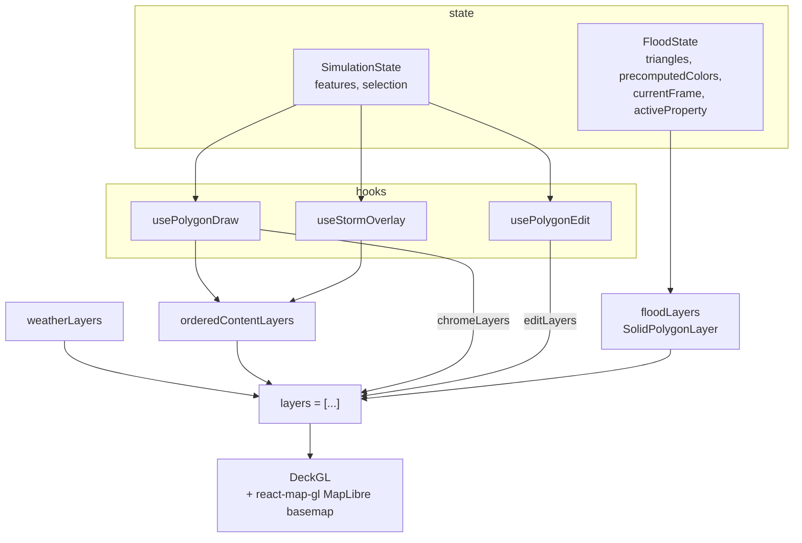

# The frontend, and the React it's built from

This is a study guide. Each React concept is introduced by the problem it
solves *in this app*, with the real file as the worked example. If you already
know React, skim the concept boxes and read the "in this codebase" parts.

Stack: React 18 + TypeScript + Vite + Tailwind v4, MapLibre GL for the basemap,
deck.gl for GPU-rendered overlays, `keycloak-js` for auth, PrimeReact for a few
widgets, CodeMirror for the Python property editor.

---

## 1. Boot path

```
main.tsx
  └─ StrictMode
      └─ BrowserRouter                    react-router-dom
          └─ App.tsx
              └─ AuthProvider             blocks render until Keycloak login
                  └─ Routes
                      /                 → pages/InstanceList
                      /instance/:id     → pages/InstanceEditor
                      /3d/:id           → pages/Instance3D
```

`services/frontend/src/main.tsx` is 13 lines and does exactly one thing:
mount `<App/>` inside a router.

### `StrictMode` — read this before the effects section

In development, `StrictMode` deliberately **mounts every component, runs its
effects, tears them down, and runs them again**. It is not a bug and it does not
happen in production builds. It exists to surface effects that aren't safely
re-runnable.

This is why the async effects in this codebase are written the way they are —
with `cancelled` flags and cleanup functions. An effect that fetches and then
calls `setState` without a cancel guard would, under StrictMode, fire twice and
potentially apply the *first* (stale) response last.

---

## 2. Directory tour

| Directory | Holds | Rule of thumb |
|---|---|---|
| `pages/` | One component per route | Owns route params, composes providers |
| `components/` | Presentational + container UI | Reads context, renders |
| `context/` | The two state machines | `*Context.ts` = types + hooks, `*Provider.tsx` = reducer + effects |
| `hooks/` | Reusable stateful logic | Each returns deck.gl layers + handlers |
| `utils/` | Pure functions | No React imports at all |
| `config/` | Declarative registries | The single source of truth — edit here, not in components |
| `types/` | Shared TypeScript types | |
| `auth/` | Keycloak instance + `authFetch` | |

The `config/` rule is load-bearing. `config/polygonTypes.ts` is a registry:

```ts
export const POLYGON_TYPES: Record<string, PolygonTypeDef> = {
  region: {
    key: "region",
    label: "Region",
    icon: "▢",
    description: "Domain sub-area: friction & initial conditions",
    color: { fill: [...], stroke: [...], fillSelected: [...] },
    properties: [ /* PropertyDef[] */ ],
    edgeProperties: [ /* optional PropertyDef[] */ ],
  },
  // ...
};
```

Adding a polygon type here automatically gives you: a draw button, the right
colours in `usePolygonDraw`, a property panel rendered from `properties`, edge
editing if `edgeProperties` is present, and correct serialize/deserialize
behaviour — because `utils/deserialize.ts` reads the same registry to know which
keys are code-typed. `config/simulationConfig.ts` reuses the very same
`PropertyDef` shape for solver parameters, so one form component renders both.

`config/theme.ts` is the same idea for map style, playback speeds, colours, and
labels.

---

## 3. The React hooks, taught through this code

### 3.1 `useState` — the one you already know

> **What it does.** Returns `[value, setValue]`. Calling `setValue` schedules a
> re-render of that component. Updates are batched within an event handler.
> If the next value depends on the previous, pass a function:
> `setTransform(prev => prev ?? fallback)`.

In this codebase `useState` is used for **ephemeral UI state that nobody else
needs** — things that vanish when the component unmounts and don't belong in
a shared reducer:

`components/FloodMap.tsx:65-79`
```ts
const [useOsm, setUseOsm]           = useState(false);   // basemap toggle
const [showWeather, setShowWeather] = useState(false);   // debug overlay on/off
const [shiftHeld, setShiftHeld]     = useState(false);   // modifier key
const [dragging, setDragging]       = useState(false);   // is a gizmo being dragged
```

Contrast with the drawn polygons, which *do* need to be shared, persisted, and
undone — those live in a reducer (§3.2).

### 3.2 `useReducer` — when many actions touch one shape of state

> **What it does.** `useReducer(reducer, initialState)` returns
> `[state, dispatch]`. Instead of calling many setters, you `dispatch` an action
> object and a single pure `reducer(state, action)` function computes the next
> state. The reducer must be **pure** and must **not mutate** — always return a
> new object.

`context/SimulationProvider.tsx` has roughly eighteen action types:

```ts
type Action =
  | { type: "HYDRATE"; features: FeatureCollection; config: Record<string, any> }
  | { type: "ADD_FEATURE"; feature: Feature }
  | { type: "DELETE_FEATURE"; index: number }
  | { type: "UPDATE_FEATURE_PROP"; polyIdx: number; key: string; value: any }
  | { type: "MOVE_VERTEX"; polyIdx: number; vertexIdx: number; coord: [number, number] }
  | { type: "INSERT_VERTEX"; polyIdx: number; edgeIdx: number; coord: [number, number] }
  | { type: "MOVE_FEATURE"; from: number; to: number }
  // …
```

Try to picture that as eighteen `useState` hooks with interlocking updates — that
is the argument for `useReducer` in one image. Adding a vertex has to change the
geometry *and* insert an edge-property slot *and* recompute the total area,
atomically. As a reducer case that's one place; as setters it's three that can
drift.

**Immutability in practice.** Look at `withRing` (`SimulationProvider.tsx:111`):

```ts
function withRing(state, polyIdx, fn) {
  const feats = [...state.features.features];         // copy the array
  const f: any = feats[polyIdx];
  if (!f) return state;                                // no-op returns SAME object
  const { ring, edges } = fn(
    [...f.geometry.coordinates[0]],                    // copy the ring
    f.properties?.edges ? [...f.properties.edges] : undefined,
  );
  feats[polyIdx] = {                                   // replace, don't mutate
    ...f,
    geometry: { ...f.geometry, coordinates: [ring] },
    properties: { ...f.properties, ...(edges !== undefined ? { edges } : {}) },
  };
  const features = { ...state.features, features: feats };
  return { ...state, features, areaSqM: calcArea(features) };
}
```

Three of the vertex-editing cases funnel through it. Note the two habits worth
copying:

1. **Returning `state` unchanged when nothing applies** (`if (!f) return state`).
   React bails out of the re-render when the reducer returns the identical
   object — a cheap and free optimisation.
2. **Derived state computed in the reducer** (`areaSqM: calcArea(features)`), so
   it can never be out of sync with the features it's derived from.

`MOVE_FEATURE` and `REORDER_FEATURE` are worth reading closely for their `remap`
helpers: when you reorder the feature array, the *selected index* has to move
with it, or the user's selection silently jumps to a different polygon.

`FloodProvider.tsx` uses the same pattern for a much smaller state — the loaded
dataset, current frame, opacity, playback speed.

### 3.3 `useContext` — and why there are two contexts per provider

> **What it does.** `useContext(SomeContext)` reads the nearest matching
> `<SomeContext.Provider value={…}>` above it in the tree. **Every consumer
> re-renders whenever that `value` changes identity** — even if it only reads a
> field that didn't change.

That last sentence is the whole reason this codebase splits state from actions:

`context/FloodContext.ts:21-22`
```ts
export const FloodStateContext   = createContext<FloodState | null>(null);
export const FloodActionsContext = createContext<FloodActions | null>(null);
```

`state` changes on every frame tick during playback. `actions` is memoized and
almost never changes identity. A component that only *dispatches* — a play
button, a "clear all" button — subscribes to `FloodActionsContext` alone and
therefore does not re-render 8 times a second while an animation plays.

**The custom-hook wrapper pattern**, used for all four contexts:

```ts
export function useFloodState(): FloodState {
  const ctx = useContext(FloodStateContext);
  if (!ctx) throw new Error("Missing Provider");
  return ctx;
}
```

This buys two things: the return type is non-nullable (no `?.` at every call
site), and using the hook outside its provider fails loudly at the point of the
mistake instead of producing a confusing `null` far away.

### 3.4 `useMemo` — the load-bearing hook here

> **What it does.** `useMemo(() => compute(), [deps])` recomputes only when a
> dependency changes by `Object.is`. It is a **caching** tool, and also an
> **identity-stability** tool: it keeps returning the *same object reference*
> until deps change, which matters when that object is itself a dependency of
> something else.

This app renders hundreds of thousands of triangles, so identity stability isn't
a micro-optimisation — it's the difference between a usable map and a stuck one.

**Example 1 — the flood layer** (`components/FloodMap.tsx:417`):

```ts
const floodLayers = useMemo(() => {
  if (!triangles || !precomputedColors || !showSolution) return [];
  const src = precomputedColors[activeProperty]?.[currentFrame];
  if (!src) return [];
  return [ new SolidPolygonLayer({
    id: "flood-triangles",
    data: triangles,
    getPolygon: (d) => d,
    getFillColor: (_d, { index }) => {
      const off = index * 4;
      return [src[off], src[off + 1], src[off + 2], src[off + 3]];
    },
    updateTriggers: { getFillColor: [currentFrame, activeProperty] },
    /* … */
  })];
}, [triangles, precomputedColors, currentFrame, activeProperty, opacity, /* … */]);
```

`updateTriggers` is deck.gl's own version of a dependency array: deck.gl caches
GPU attribute buffers and only re-runs `getFillColor` for every row when a listed
value changes. Two caching layers, stacked.

**Example 2 — the comment that explains the whole idea**
(`hooks/useStormOverlay.ts:55`):

```ts
// Memoized: this object is a dependency of the layer memo below, so building
// a fresh literal on every render would rebuild every storm's BitmapLayer on
// every render — including the one-per-mousemove renders while drawing a
// polygon, which is exactly when the map needs to stay responsive.
const selected = useMemo(() => /* … */, [features.features, selectedFeatureIndex]);
```

That is the canonical `useMemo` motivation: not "this computation is slow", but
"this value's *identity* feeds something expensive downstream".

**Example 3 — layer ordering** (`FloodMap.tsx:188`):

```ts
const orderedContentLayers = useMemo(() => {
  const result: any[] = [];
  simFeatures.features.forEach((f, idx) => {
    const layers = f.properties?._type === "storm"
      ? stormLayersByIdx.get(idx)
      : polygonLayersByIdx.get(idx);
    if (layers) result.push(...layers);
  });
  return result;
}, [simFeatures, stormLayersByIdx, polygonLayersByIdx]);
```

The hooks return `Map<index, layers>` rather than flat arrays specifically so
this can interleave storms and polygons in feature order — which is what makes
`sendToBack` / `bringToFront` actually change what's painted on top.

**Example 4 — expensive one-shot work at load**
(`utils/colors.ts:38`, called from the `LOAD` reducer case):
`precomputeAllColors` walks every triangle × every frame × four properties once
and produces `Record<property, Uint8Array[]>` — a ready-to-index RGBA buffer per
frame. Playback then costs one array lookup per triangle instead of a colour
computation.

### 3.5 `useCallback` — `useMemo` for functions

> **What it does.** `useCallback(fn, deps)` is `useMemo(() => fn, deps)`. It
> keeps a function's identity stable so it can safely be a dependency of another
> memo, or a prop to a memoized child.

`FloodMap`'s `onDragStart` / `onDrag` / `onDragEnd`, `renderTooltip`, and
`getCursor` are all `useCallback`s. `SimulationProvider`'s `closeStream`,
`loadStoredSolution`, `streamJobStatus`, and `submitSimulation` are too — and
they form a small dependency chain:

```
closeStream ──┐
              ├─→ streamJobStatus ──→ submitSimulation ──→ actions (useMemo)
loadStoredSolution ─┘
```

If `closeStream` were a fresh function each render, every link above it would
be rebuilt, and the `actions` object handed to `SimulationActionsContext` would
change identity on every render — defeating the state/actions split from §3.3
entirely.

### 3.6 `useRef` — three genuinely different jobs

> **What it does.** `useRef(initial)` returns a mutable `{ current }` box that
> survives re-renders. **Writing to `.current` does not trigger a re-render.**

The codebase uses it for three distinct purposes; recognising which is which
makes the code much easier to read.

**(a) Mutable state that must not cause a render** — drag tracking:

`hooks/usePolygonEdit.ts:33`
```ts
const [dragVertex, setDragVertex] = useState<number | null>(null);
const dragRef = useRef<number | null>(null);
```

Both hold the same thing. The `useState` copy drives the rendering (highlight
the dragged vertex); the ref copy is what event handlers read, because a
handler closed over during an earlier render would otherwise see a **stale**
`dragVertex`. The file's own comment: *"ref avoids stale closures mid-drag"*.

**(b) Imperative handles to non-React objects:**

`context/SimulationProvider.tsx:367` — `eventSourceRef` holds the live
`EventSource`. An SSE connection is not React state; it's a resource that must
be closed exactly once. `context/FloodProvider.tsx:50` — `intervalRef` holds the
playback `setInterval` id, for the same reason.

**(c) Latches and timers** — the most interesting one:

`SimulationProvider.tsx:373`
```ts
// Hydration gate: don't autosave until the initial load has happened,
// otherwise the empty initial state would overwrite the saved instance.
const hydratedRef = useRef(false);
const saveTimer = useRef<ReturnType<typeof setTimeout> | null>(null);
```

`hydratedRef` prevents a real bug: the autosave effect watches
`[state.features, state.config]`, and on mount those are the *empty* initial
values. Without the gate, the first render would PATCH an empty setup over the
user's saved work. It's a ref rather than state because flipping it must not
itself trigger a render.

Also note how it's set:

```ts
queueMicrotask(() => { hydratedRef.current = true; });
```

The comment explains it: *"A microtask defer ensures the HYDRATE dispatch lands
first."* Setting the flag synchronously would open the gate before the hydrated
state was committed.

### 3.7 `useEffect` — synchronising with the outside world

> **What it does.** Runs *after* render. Return a function to clean up — it runs
> before the next run of the effect and on unmount. The dependency array
> controls when it re-runs; `[]` means "once on mount" (twice in StrictMode dev).
>
> **Effects are for synchronising with things outside React** — timers,
> subscriptions, network, DOM listeners. They are not for deriving state from
> other state; do that during render or in the reducer.

Four worked examples, in increasing order of subtlety.

**(a) A timer** (`FloodProvider.tsx:56`):

```ts
useEffect(() => {
  if (intervalRef.current) { clearInterval(intervalRef.current); intervalRef.current = null; }
  if (state.isPlaying && state.dataset) {
    const ms = Math.max(theme.playback.minInterval,
                        theme.playback.baseInterval / state.playbackSpeed);
    intervalRef.current = setInterval(() => {
      dispatch({ type: "SET_FRAME", frame: (frameRef.current + 1) % (maxFrameRef.current + 1) });
    }, ms);
  }
  return () => { if (intervalRef.current) clearInterval(intervalRef.current); };
}, [state.isPlaying, state.playbackSpeed, state.dataset]);
```

Look at what the interval callback reads: `frameRef.current`, not
`state.currentFrame`. The callback is created once when the effect runs; if it
closed over `state.currentFrame` it would advance from the same frame forever.
The refs are refreshed on every render, just above the effect:

```ts
frameRef.current = state.currentFrame;
if (state.dataset) maxFrameRef.current = state.dataset.times.length - 1;
```

**(b) DOM event listeners** (`FloodMap.tsx:114`): `keydown`/`keyup` for the
Shift modifier, with the matching `removeEventListener` calls in the cleanup.
Forgetting the cleanup here leaks a listener per mount — and under StrictMode
you'd get two.

**(c) An async fetch with a cancel guard** (`FloodMap.tsx:134`):

```ts
let cancelled = false;
fetchWeatherGrid(bounds, weatherVar)
  .then((grid) => { if (!cancelled) { /* setState… */ } })
  .catch((err) => { if (!cancelled) { /* setError… */ } });
return () => { cancelled = true; };
```

The same shape appears in `SimulationProvider`'s hydrate effect. This is the
standard guard against a slow response landing after the component unmounted or
after a newer request superseded it.

**(d) A debounce** (`SimulationProvider.tsx:435`):

```ts
useEffect(() => {
  if (!hydratedRef.current) return;                     // the gate from §3.6
  if (saveTimer.current) clearTimeout(saveTimer.current);
  saveTimer.current = setTimeout(async () => {
    const payload = serializePayload(state);
    await updateInstance(publicId, { instance: payload });
    onSolvedChange?.(false);
  }, AUTOSAVE_DEBOUNCE_MS);                             // 800 ms
  return () => { if (saveTimer.current) clearTimeout(saveTimer.current); };
}, [state.features, state.config, publicId]);
```

Every keystroke in a property field re-runs this effect, the cleanup cancels the
previous timer, and only 800 ms of quiet actually fires a PATCH. Note the
deliberately *narrow* dependency array: `state.features` and `state.config`, not
`state`. Dragging a selection or opening the draw tool changes `state` but must
not trigger a save. (This is why the `// eslint-disable-next-line
react-hooks/exhaustive-deps` comment is there — the narrowing is intentional.)

`submitSimulation` clears the same timer before enqueueing, so a run always
solves the setup the user is actually looking at.

---

## 4. The two providers

The app has two independent state machines. Knowing which one owns what is most
of the mental model.

| | `FloodProvider` | `SimulationProvider` |
|---|---|---|
| Concern | **Viewing** a result | **Authoring** a setup |
| Files | `context/FloodContext.ts`, `context/FloodProvider.tsx` | `context/SimulationContext.ts`, `context/SimulationProvider.tsx` |
| Owns | `dataset`, `triangles`, `precomputedColors`, `currentFrame`, `isPlaying`, `playbackSpeed`, `opacity`, `activeProperty`, `selectedTriangle`, `showSolution` | `features` (GeoJSON), `config`, `isDrawing`/`activeType`, selection indices, `isEditing`, `areaSqM`, `job` |
| Side effects | playback interval | hydrate, debounced autosave, submit, SSE stream, result download |
| Bound to | nothing | one `publicId` |

They are nested in `pages/InstanceEditor.tsx:93`:

```tsx
<FloodProvider>
  <SimulationProvider publicId={publicId} onSolvedChange={setSolved}>
    <EditorShell solved={solved} publicId={publicId} />
  </SimulationProvider>
</FloodProvider>
```

Flood is the *outer* one because Simulation depends on it:
`SimulationProvider.tsx:369` does `const { loadDataset } = useFloodActions();`
and calls it once a solve completes. That's the only coupling between them, and
it points in one direction: authoring hands a finished dataset to viewing.

### The `LOAD` action — where a downloaded result becomes render state

`FloodProvider.tsx:14`:

```ts
case "LOAD": {
  const ds = action.dataset;
  ds.meta   = { /* nframes, ntriangles, properties, … */ };
  ds.legend = { depth: {…}, speed: {…}, momentum: {…}, hazard: {…} };
  const precomputed = precomputeAllColors(ds);
  return { ...state, dataset: ds,
           triangles: buildTrianglePolygons(ds),
           precomputedColors: precomputed,
           /* reset playback */ };
}
```

Two pieces of derived data are built once here and never again:
`buildTrianglePolygons` (`utils/mesh.ts:5`) turns the flat index/vertex buffers
into deck.gl-ready `[[lng,lat],[lng,lat],[lng,lat]]` rings, and
`precomputeAllColors` builds every frame's RGBA buffer.

*(Strictly, this case mutates `ds` in place before spreading — a reducer purity
wart. It works because `ds` was just created by `decodeResult` and nothing else
holds a reference to it, but it's not a pattern to copy.)*

---

## 5. Custom hooks

Three hooks, one shape. Each: reads persistent state from `SimulationContext`,
keeps ephemeral interaction state local, and returns **deck.gl layers plus
event handlers** for `FloodMap` to compose.

| Hook | Owns | Returns |
|---|---|---|
| `usePolygonDraw` | in-progress points, cursor position, double-click timing | `polygonLayersByIdx`, `chromeLayers`, `handleClick`, `handleHover` |
| `usePolygonEdit(shiftHeld)` | which vertex is being dragged | `editLayers`, `isDraggingVertex` |
| `useStormOverlay(shiftHeld)` | drag mode, fetched rain grids, painted canvases | `stormLayersByIdx`, `stormProbe`, `isStormActive`, `isDraggingStorm` |

The division of labour is stated at the top of `usePolygonDraw.ts`:

> *Persistent state (features, selection, type) lives in SimulationContext.
> Ephemeral state (in-progress points, cursor) stays local — no reason to
> persist them.*

That's a good default rule: if closing the browser mid-action should lose it,
it's local state.

`usePolygonEdit`'s interaction model is a nice compact example of encoding UI
affordances as layers:

- drag a white vertex → `moveVertex`
- click an amber midpoint → `insertVertex` (splits the edge)
- Alt+click a vertex → `deleteVertex` (refuses below 3 vertices)

**On not sharing code:** `useStormOverlay`'s header comment explains that it was
deliberately *not* merged with `FloodMap`'s visually identical weather gizmo,
because one is a persisted, selection-gated feature committed via
`updateFeatureProperty` and the other is an ephemeral debug overlay — sharing
would mean threading more flags than it saves. Worth reading as an example of
when duplication is the right call.

---

## 6. Rendering the mesh



Composition order matters and is spelled out in `FloodMap.tsx:459`:
`weather → ordered content (storms + polygons) → drawing chrome → edit handles
→ flood`. Later entries paint on top.

Two details worth knowing:

- `parameters: { depthTest: false }` on the flood layer — the mesh is flat 2D
  geometry, so depth testing would only cause z-fighting between coplanar
  triangles.
- `pickable` is switched off while drawing or while transforming a storm/weather
  gizmo, so clicks meant for a handle don't fall through and select a triangle.

### The 3D view

`pages/Instance3D.tsx` + `utils/mesh3d.ts` render the same dataset as real
geometry. Two ideas there are worth reading even if you never touch 3D:

**Per-triangle scalars → per-vertex heights.** The solution stores one elevation
and one depth *per triangle*. Rendered directly, that's a field of flat plates —
the file calls it the "wedding cake" look. `buildVertexElevations` and
`buildWaterSurface` average each triangle's value onto its vertices, giving a
continuous surface across shared edges.

**Absolute height, not extrusion.** Water is emitted as 3D rings
(`[lng, lat, z]`) at `z = elevation + depth`, *not* as an `extruded` layer.
Extruding would build a column from `z = 0` up to the water surface — huge
prisms over inland terrain, wrecking depth precision.

`buildTerrainSurface` and `buildWaterSurface` must be passed the **same**
`zScale`; they come from one DEM, and scaling them together is what keeps the
water sitting in its channel.

---

## 7. The serialize / deserialize round-trip

A good lesson in "model state for editing, then translate at the boundary".

**In the editor**, a property that can be either a constant or a Python
expression is stored flat, because that's what a form binds to easily:

```
{ Q_source: "python", Q_code: "def Q(t): return 5*t", Q: 12 }
```

**On the wire**, it's collapsed into one self-describing value
(`utils/serialize.ts:80`):

```json
{ "Q": { "type": "python", "code": "def Q(t): return 5*t" } }
```

`serializePayload` also groups features by `_type`, strips internal keys
(`_type`, `edges` are moved out of `properties`), and emits:

```ts
{ config: {...}, features: { region: [...], inlet: [...], storm: [...] } }
```

Storms are special-cased in both directions: they carry no polygon properties,
only `{storm_ref, placement, scale}`. Their on-map rectangle is *rebuilt* from
the placement transform by `placementToFeature` on load rather than being
stored as geometry.

`deserializePayload` (`utils/deserialize.ts`) inverts all of it, and crucially
does so **by consulting the registry**, not by guessing:

```ts
function codeKeysForType(typeKey: string): Set<string> {
  const def = POLYGON_TYPES[typeKey];
  // code keys are named `<base>_code`; the base is the toggled property
  for (const p of def.properties) if (p.type === "code") keys.add(p.key.replace(/_code$/, ""));
}
```

And it merges over defaults —
`{ ...defaultSimConfig(), ...(payload?.config ?? {}) }` — so an instance saved
before a new solver parameter existed still loads with that parameter present.
That one line is what makes the format forward-compatible.

---

## 8. Where the data actually comes from

`utils/api.ts` is the typed client. Every function goes through `authFetch`, so
token refresh exists in exactly one place:

```ts
listInstances()  GET    /api/instances
createInstance() POST   /api/instances
getInstance()    GET    /api/instances/{id}
updateInstance() PATCH  /api/instances/{id}
deleteInstance() DELETE /api/instances/{id}
enqueueSimulation() POST /api/instances/{id}/simulate
```

The result download is *not* in this file, and deliberately so — it isn't JSON.
`fetchResultDataset` (`SimulationProvider.tsx:136`) does:

```ts
const res = await authFetch(url);
// The solution is a binary container (the browser has already gunzipped it
// via Content-Encoding). Never res.json(): a large run exceeds V8's ~512MB
// single-string cap and fails as "Unexpected end of JSON input".
return decodeResult(await res.arrayBuffer());
```

See [solution-binary-format.md](solution-binary-format.md) for what's inside
that buffer.

---

## 9. Dead ends you'll trip over

- **`utils/decode.ts`** is two stub lines, and `decodeFrame` in `FloodProvider`
  returns `{ _t }`. Both are leftovers from the pre-binary RLE format kept alive
  only so old imports still resolve. The real decode is `utils/decodeResult.ts`.
- **`colorLUT`, `frameCache`, `triangleHistories`** in `FloodState` are typed
  `any` and permanently `null` — same story, flagged in the file as *"Keep to
  satisfy old types"*. `buildColorLUT` / `buildTriangleHistories` at the bottom
  of `utils/colors.ts` are no-op dummies.
- **`meta.rle: false`** is hardcoded. The format has no RLE any more.
- **`momentum`** is offered in the property selector but the worker never emits
  it, so it renders all-zero (documented at `utils/colors.ts:36`).
- **`FloodProvider`'s reducer has a `TOGGLE_SHOW_SOLUTION` case that isn't in
  its `Action` union** — it works at runtime, but TypeScript isn't checking it.
- `CLAUDE.md` mentions a `useFloodLayer` hook. It doesn't exist; the layer is
  built inline in `FloodMap.tsx:417`.

---

## 10. Suggested reading order

Ten files, in this order, and you'll have the whole frontend:

1. `src/main.tsx` — 13 lines
2. `src/components/App.tsx` — routes and the auth gate
3. `src/config/polygonTypes.ts` — the registry everything reads
4. `src/context/FloodContext.ts` — the two-context pattern, small enough to hold whole
5. `src/context/FloodProvider.tsx` — `useReducer` + the playback effect
6. `src/context/SimulationProvider.tsx` — the big one: reducer, hydrate, autosave, SSE
7. `src/utils/serialize.ts` + `src/utils/deserialize.ts` — read as a pair
8. `src/hooks/usePolygonDraw.ts` — the hook shape
9. `src/components/FloodMap.tsx` — composition of everything above
10. `src/utils/decodeResult.ts` — then continue into
    [solution-binary-format.md](solution-binary-format.md)
