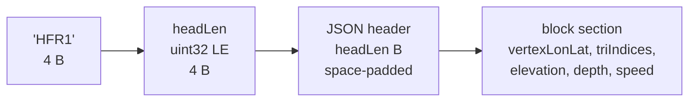
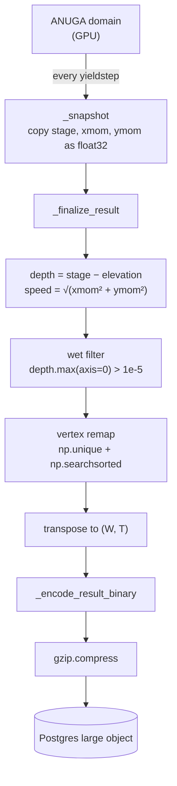
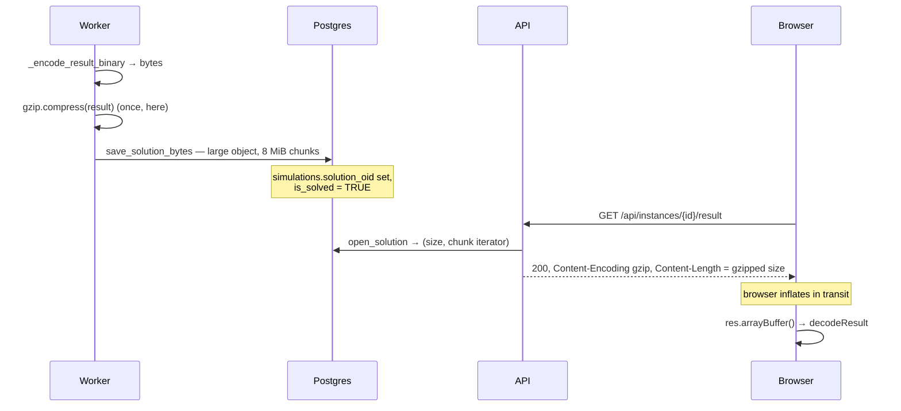

# The `HFR1` solution container

A solved simulation is not JSON. It's a small binary container written by the
worker, gzipped once, stored in Postgres as a large object, and read in the
browser as a set of `TypedArray` views over one `ArrayBuffer` — no parsing, no
copying, no per-triangle objects.

This document is the format spec plus the reasoning behind it. The two files
that define it, and which must always agree:

| Side | File | Symbol |
|---|---|---|
| Writer | `services/worker-gpu/src/tasks.py:457` | `_encode_result_binary` |
| Reader | `services/frontend/src/utils/decodeResult.ts` | `decodeResult` |

---

## 1. Why it exists

The result used to be JSON (RLE-encoded, decoded through an LRU frame cache).
Two things killed that, both hit in practice on a run with roughly 1.8 million
elements. From `types/flood.ts` and `_encode_result_binary`'s docstring:

- **V8's single-string cap.** `Response.json()` must materialise the entire
  payload as **one JavaScript string** before `JSON.parse` can run, and V8 caps
  a single string near 512 MB no matter how much heap the browser was given.
  Past that you get `Unexpected end of JSON input` — a message that tells you
  nothing about the real cause.
- **Object overhead.** A million-plus small objects, each holding two `number[]`
  arrays, costs far more memory and GC time than flat typed arrays holding the
  same numbers.

The fix is to keep the *description* as JSON (it's tiny and self-describing) and
send the *bulk numbers* as raw little-endian typed blocks. Decoding becomes a
`memcpy`-shaped operation rather than a parse.

A related consequence, noted at the top of `tasks.py:52`: there is no
decimal-rounding constant any more. Values ship as `float32`, which is finer
than any depth a solver meaningfully resolves. That removed an old trap where
coarse rounding could zero sub-centimetre depths *before* the wet/dry filter
ever saw them.

---

## 2. Byte layout

All multi-byte values are **little-endian**.

```
offset   size        contents
───────  ──────────  ────────────────────────────────────────────────────
0        4           magic, ASCII "HFR1"
4        4           uint32  headLen  — byte length of the header block
8        headLen     JSON header, UTF-8, right-padded with spaces
8+headLen …          block section: typed arrays, each 8-byte aligned
```



### The two paddings, and what breaks without them

**Header padding** (`tasks.py:501`):
```python
head += b" " * ((-(8 + len(head))) % 8)
```
This makes `8 + headLen` a multiple of 8, so the block section itself starts
8-byte aligned. Trailing spaces are legal JSON whitespace, so `JSON.parse` is
unaffected.

**Per-block padding** (`tasks.py:480`):
```python
payload.extend(b"\0" * ((-len(payload)) % 8))   # before recording the offset
```
Every block starts at an 8-byte-aligned offset within the block section.

Both exist for the same reason: **a `TypedArray` view over an `ArrayBuffer` must
be aligned to its element size or the constructor throws.** `Float64Array` needs
8. Since the block section is 8-aligned and every offset within it is 8-aligned,
every view is valid.

The reader checks anyway (`decodeResult.ts:58`):

```ts
if (byteOffset % Ctor.BYTES_PER_ELEMENT !== 0) {
  // The writer pads every block, so this should not happen — but a
  // misaligned view throws a confusing RangeError, so say what went wrong.
  throw new Error(`Solution block "${name}" is misaligned at ${byteOffset}`);
}
```

That is a good habit to copy: turn an impossible-but-catastrophic condition into
a message that names the problem.

---

## 3. The header

```json
{
  "version": 1,
  "nVertices": 48211,
  "nTriangles": 91044,
  "nFrames": 181,
  "times": [0.0, 20.0, 40.0, ...],
  "blocks": {
    "vertexLonLat": { "dtype": "f8", "offset": 0,       "length": 96422 },
    "triIndices":   { "dtype": "i4", "offset": 771376,  "length": 273132 },
    "elevation":    { "dtype": "f4", "offset": 1864904, "length": 91044 },
    "depth":        { "dtype": "f4", "offset": 2229080, "length": 16478964 },
    "speed":        { "dtype": "f4", "offset": 68144936,"length": 16478964 }
  }
}
```

- `offset` is in **bytes**, relative to the start of the block section
  (`8 + headLen`), not to the start of the file.
- `length` is in **elements**, not bytes.
- `times[]` carries the simulation time in seconds of each frame — the only
  non-scalar metadata that stays in the header, because it's `nFrames` long, not
  `nTriangles × nFrames`.
- `dtype` is one of `f8` (float64), `f4` (float32), `i4` (int32).

The reader validates `version === 1` and rejects anything else with a clear
message. It also validates each block's `dtype` against what it expects, so a
writer change that silently narrows a type fails loudly instead of producing
garbage.

---

## 4. The blocks

| Name | dtype | Length | Meaning |
|---|---|---|---|
| `vertexLonLat` | `f8` | `nVertices × 2` | lon, lat **interleaved** (WGS84 degrees) |
| `triIndices` | `i4` | `nTriangles × 3` | three vertex ids per triangle, indexing `vertexLonLat` |
| `elevation` | `f4` | `nTriangles` | ground height (m) under each triangle |
| `depth` | `f4` | `nTriangles × nFrames` | water depth (m) |
| `speed` | `f4` | `nTriangles × nFrames` | speed (m/s) |

**Why `f8` for coordinates and `f4` for everything else.** The writer's comment
says it in six words: *"f8: ~1e-7 deg matters at metre scale"*. One degree of
latitude is about 111 km, so 1e-7° is about 1 cm. `float32` gives roughly 7
significant decimal digits, which at longitude ≈ -0.38 and latitude ≈ 39.5
leaves you with metre-scale quantisation of the mesh — visible as a jittering,
non-watertight mesh. Depth and speed have no such problem: `float32` resolves
far below any depth a solver produces.

**Why `elevation` is in there at all.** It's the DEM the solve *actually ran on*.
Shipping it means the 3D view can sit the water surface on exactly the same
ground ANUGA used — `water z = elevation + depth[frame]` — instead of
re-sampling a DEM client-side and getting a slightly different surface.

### Indexing: `[tri * nFrames + frame]`

Per-frame series are laid out **triangle-major**: one triangle's entire time
series is contiguous.

```
depth = [ tri0_f0, tri0_f1, …, tri0_fN,   tri1_f0, tri1_f1, …, tri1_fN,   … ]
          └────── triangle 0 ─────────┘   └────── triangle 1 ─────────┘
```

To read triangle `t` at frame `f`:

```ts
const value = dataset.depth[t * dataset.nFrames + f];
```

Worked example with `nFrames = 181`: triangle 500 at frame 12 is index
`500 * 181 + 12 = 90 512`.

The writer produces this layout explicitly (`tasks.py:437`):

```python
# Transpose to (W, T) so each triangle's series is one contiguous row,
# which is the layout the frontend indexes as [tri * nFrames + frame].
depth_w = depth[:, wet_idx].T
speed_w = speed[:, wet_idx].T
```

**Why triangle-major and not frame-major?** Both consumers walk it that way. The
tooltip and `TriangleHistory` need one triangle across all frames — contiguous.
And `precomputeAllColors` (`utils/colors.ts:49`) iterates
`for triIdx … for f …`, so each inner loop reads sequential memory. The one
consumer that wants a whole frame at once — playback — reads from the
precomputed RGBA buffers instead, never from `depth`/`speed` directly.

---

## 5. How the data is produced



### `_snapshot` — `tasks.py:378`

Per yieldstep (default 20 s of simulated time) the worker copies exactly three
float32 arrays: `stage`, `xmomentum`, `ymomentum`. Nothing is derived here.

The copies are mandatory, and the comment says why: `centroid_values` is
**ANUGA's live buffer** and is overwritten on the next step. `np.array(..., dtype=float32)`
copies; a view would silently alias.

`domain.set_store(False)` is set elsewhere so ANUGA skips its own per-yieldstep
`.sww` write and the device→host sync that comes with it.

### `_finalize_result` — `tasks.py:395`

Everything else happens once, at the end, vectorized:

```python
depth = stage - elev[None, :]                 # (T, N)
speed = np.sqrt(xmom**2 + ymom**2)            # (T, N)
```

Then the **wet filter**:

```python
wet = depth.max(axis=0) > depth_threshold     # 1e-5, per triangle over all time
wet_idx = np.flatnonzero(wet)
```

A triangle that never got wet at any point in the run is dropped entirely. On a
basin-scale domain this is most of the mesh, and it is the single biggest factor
in the result's size.

Dropping triangles orphans vertices, so the vertex ids have to be **remapped**:

```python
tri_wet  = tri_indices[wet_idx]        # (W, 3), still holding OLD vertex ids
used     = np.unique(tri_wet)          # sorted list of old ids actually referenced
remapped = np.searchsorted(used, tri_wet)   # (W, 3), new ids
new_vertices = vertices[used]          # the matching subset, fancy-indexed
```

This is a compact idiom worth recognising: because `used` is sorted,
`searchsorted(used, x)` gives each old id its position in `used`, which is
exactly its new id. Two NumPy calls, no Python loop, no dictionary.

`elevation` is subset the same way (`elev[wet_idx]`), then everything is
transposed and encoded.

### Encoding — `tasks.py:472`

```python
blocks = {}
payload = bytearray()

def add(name, arr, dtype):
    a = np.ascontiguousarray(arr, dtype=_DTYPES[dtype]).reshape(-1)
    payload.extend(b"\0" * ((-len(payload)) % 8))          # align
    blocks[name] = {"dtype": dtype, "offset": len(payload), "length": int(a.size)}
    payload.extend(a.tobytes())

add("vertexLonLat", vertex_lonlat, "f8")
add("triIndices",   tri_indices,   "i4")
add("elevation",    elevation,     "f4")
add("depth",        depth,         "f4")
add("speed",        speed,         "f4")
```

`np.ascontiguousarray(...).reshape(-1)` is doing real work: after the transpose,
`depth_w` is a *view* with non-contiguous strides, and `.tobytes()` on it would
still produce correct bytes but by way of a copy in the wrong order if the
reshape were done first. Forcing C-contiguity, then flattening, guarantees the
row-major `[tri][frame]` order the reader assumes.

---

## 6. Transport



Four decisions in that diagram, each with a reason:

**Compressed exactly once.** The worker gzips; the API sets
`Content-Encoding: gzip` and streams the stored bytes untouched. This is why
`db.save_solution_bytes` exists next to `db.save_solution` — the latter takes a
dict and gzips it, and calling it from the GPU worker would double-compress.

**Stored as a Postgres large object, not inline `bytea`.** From the docstring at
`services/api/src/db.py:296`: as an inline `bytea` parameter, psycopg2
hex-escapes the blob into the SQL text, doubling its size, and anything past
about 500 MB makes the server reject the statement with *"invalid memory alloc
request size"*. Writes go in 8 MiB chunks (`SOLUTION_CHUNK`), and the previous
solution's large object is unlinked so re-running a simulation doesn't leak it.

**Streamed back in chunks.** `open_solution` (`db.py:229`) returns a generator;
`StreamingResponse` consumes it. A solved basin runs to hundreds of megabytes —
buffering it whole would OOM the API pod. The generator holds a pooled
connection open until exhausted, so it must be consumed fully.

**`Content-Length` is the gzipped size.** That's what's actually on the wire, so
the browser can render a real download progress bar rather than an indeterminate
spinner.

---

## 7. The reader

`services/frontend/src/utils/decodeResult.ts`, in full sequence:

```ts
if (buf.byteLength < 8) throw new Error("Solution response is truncated");

const magic = String.fromCharCode(...new Uint8Array(buf, 0, 4));
if (magic !== MAGIC) throw new Error(
  `Unrecognised solution format "${magic}" — expected ${MAGIC}. ` +
  `Re-run the simulation to regenerate it in the current format.`);

const headLen    = new DataView(buf).getUint32(4, true);       // true = little-endian
const headerText = new TextDecoder().decode(new Uint8Array(buf, 8, headLen));
const header     = JSON.parse(headerText) as ResultHeader;
if (header.version !== 1) throw new Error(`Unsupported solution version ${header.version}`);

const base = 8 + headLen;
return {
  meta: buildMeta(header),
  legend,
  times: header.times,
  nVertices: header.nVertices, nTriangles: header.nTriangles, nFrames: header.nFrames,
  vertexLonLat: readBlock(buf, base, b.vertexLonLat, "vertexLonLat", "f8"),
  triIndices:   readBlock(buf, base, b.triIndices,   "triIndices",   "i4"),
  elevation:    readBlock(buf, base, b.elevation,    "elevation",    "f4"),
  depth:        readBlock(buf, base, b.depth,        "depth",        "f4"),
  speed:        readBlock(buf, base, b.speed,        "speed",        "f4"),
};
```

`readBlock` is where the "no copying" claim is cashed:

```ts
return new Ctor(buf, byteOffset, spec.length);
```

`new Float32Array(buffer, byteOffset, length)` creates a **view** — it does not
allocate or copy. Every field of the returned `FloodDataset` points into the one
`ArrayBuffer` that came off the network. The whole decode is: read 4 bytes, parse
a small JSON object, construct five views.

The magic-mismatch message deserves a note. It tells the user what to *do*
("re-run the simulation") because the realistic cause is an old instance solved
under the previous format still sitting in the database — not a corrupt
download.

### Then it becomes render state

`FloodProvider`'s `LOAD` case (`context/FloodProvider.tsx:14`) turns the decoded
dataset into what the map actually draws, once:

- `buildTrianglePolygons` (`utils/mesh.ts:5`) — walks `triIndices` and
  `vertexLonLat` into `nTriangles` deck.gl rings.
- `precomputeAllColors` (`utils/colors.ts:38`) — for each of four properties and
  each frame, a `Uint8Array(nTriangles * 4)` of RGBA. `hazard` is derived as
  `depth × speed`; `momentum` is listed but the worker never emits it, so it is
  all zero.

Playback then costs four array reads per triangle per frame. Nothing touches the
raw `depth`/`speed` buffers during animation — only the tooltip and the 3D view
do, and both index them directly with `[tri * nFrames + frame]`.

`meta` and `legend` are **synthesised on the client**, not carried in the file
(`buildMeta`, `decodeResult.ts:69`, and the legend literal in `FloodProvider`).
The wire format carries only numbers.

---

## 8. Extending the format

### Adding a block (backwards-compatible)

Say you want to ship `momentum` for real instead of the current all-zero
placeholder:

1. **Writer** — compute it in `_finalize_result`, subset it with `wet_idx`,
   transpose, and pass it to `_encode_result_binary`; add one line:
   `add("momentum", momentum, "f4")`. Order within `blocks` doesn't matter — the
   header carries offsets — but keep it stable for readability.
2. **Type** — add `momentum: Float32Array` to `FloodDataset`
   (`types/flood.ts`), with a comment stating its layout.
3. **Reader** — one `readBlock(buf, base, b.momentum, "momentum", "f4")` line.
   Decide whether a missing block is fatal: `readBlock` currently throws on a
   missing spec, so for an *optional* block, read it conditionally
   (`b.momentum ? readBlock(...) : null`) — that's what keeps old stored
   solutions loadable.
4. **Consumer** — `precomputeAllColors` already has a `momentum` branch waiting
   at `utils/colors.ts:60`; replace the `: 0` with the real value.

Adding an optional block does **not** require a magic bump: an old reader
ignores unknown block names, and a new reader that handles absence can read old
files.

### When to bump `HFR1` → `HFR2`

Bump when an old reader would misinterpret a new file rather than fail cleanly:

- changing an existing block's `dtype`, meaning, or units
- changing the index layout (e.g. frame-major instead of triangle-major)
- changing the coordinate reference of `vertexLonLat`
- making a previously optional block required

The writer's own comment (`tasks.py:450`) says exactly this: *"Bump the suffix
if the block layout ever changes incompatibly; the frontend checks it."* Note
there are two independent version signals — the 4-byte magic and
`header.version` — and the reader checks both. Use `header.version` for
additive-but-notable changes and the magic for genuine breaks.

### Things to keep in mind either way

- **Alignment.** Any new dtype must divide 8, or the padding rule needs
  revisiting. `f8` is the widest currently used.
- **The reader must stay copy-free.** If a change forces a copy on decode, you
  have given back the reason the format exists.
- **There is no schema check beyond dtype.** A block with the right dtype and
  the wrong contents decodes silently into nonsense. If you add something whose
  correctness isn't self-evident, add its length or range to the header and
  assert on it.

---

## See also

- [architecture.md](architecture.md) — where this sits in the job lifecycle
- [frontend-react.md](frontend-react.md) §6 — how the decoded arrays become
  deck.gl layers, in 2D and 3D
